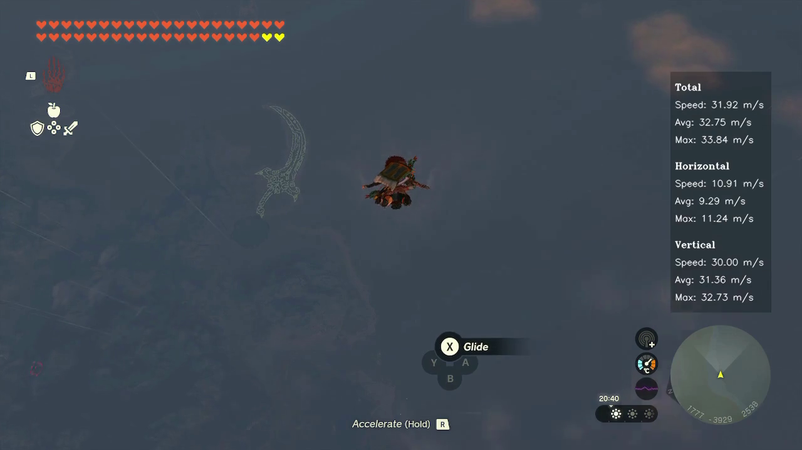

# TotK Speedometer

A speedometer for `The Legend of Zelda: Tears of the Kingdom` that overlays speed information.

- **Video mode:** Add the overlay to video gameplay footage. Supports videos from the Switch's built-in screen recorder and videos captured from other sources like OBS.
- **Real-time mode:** Creates a frameless window overlay on top of the game window from an emulator or OBS preview while playing with a HDMI capture card.

Provides independent stats for total, horizontal and vertical speeds:
  - Current speed
    - Calculated every 10 frames for video (configurable in [settings.py](settings.py))
    - As fast as it can for real-time screen capture
  - Average speed of the last 10 speed values
  - Maximum speed of the last 10 speed values


## [Watch the demo on Youtube](https://youtu.be/f210KAuhMGI)




## Requirements
- python 3.9
- tesseract 5.3.2
- ffmpeg 6.0

Tested on macOS 13.5 with python 3.9

Works on every platform (macOS, Linux and Windows) as long as the dependencies are properly installed.


## Installation

### Install Dependencies

#### Install Tesseract and FFmpeg using Homebrew (RECOMMENDED)

If you don't have Homebrew you can follow the instructions on [brew.sh](https://brew.sh) to install it.

To use Homebrew on Windows you can use the [Windows Subsystem for Linux](https://learn.microsoft.com/en-us/windows/wsl/about)

```
brew install tesseract
```

```
brew install ffmpeg
```

#### Install Tesseract and FFmpeg from the official sites (HARDER)
If you prefer not to use Homebrew you can install Tesseract and FFmpeg from the official sites.
##### Install Tesseract
Follow the Installation instructions on the [official documentation](https://tesseract-ocr.github.io/tessdoc/Installation.html).

##### Install FFmpeg
Download FFmpeg from [ffmpeg.org](https://ffmpeg.org/download.html)

You can follow this guide to [install FFmpeg on Linux, macOS, and Windows](https://www.hostinger.com/tutorials/how-to-install-ffmpeg) to complete the install process.

There is also [this guide for Windows](https://phoenixnap.com/kb/ffmpeg-windows).

I used Homebrew because it is much simpler to install and I have not tested these guides. They are here for reference and to help anyone who is interested in using the totk-speedometer but doesn't know how to install the dependencies. These guides should work but it might depend on your specific environment.


### Install TotK Speedometer
Download the zip of the latest [release](https://github.com/miguelqncosta/TotK-Speedometer/releases) and unzip it.

Open a terminal window and navigate into the TotK Speedometer directory.
```
cd location-of-the-speedometer-folder/TotK-Speedometer-X.X.X
```

Where `X.X.X` is the downloaded version number.

#### Install python dependencies
```
python3 -m pip install --upgrade pip
python3 -m pip install -r requirements.txt
```


## Configure
See the file [settings.py](settings.py) to configure the TotK Speedometer.


## Usage

Navigate into the TotK Speedometer directory.
```
cd location-of-the-speedometer-folder/TotK-Speedometer-X.X.X
```

### Add TotK speedometer overlay to a video file
```
python3 totk-speedometer.py -f <path-to-totk-video>
```

Example:
```
python3 totk-speedometer.py -f '/Users/miguelcosta/Downloads/totk-videos/2023100123530500-CC47F0DEC75C1FD3B1F95FA9F9D57667.mp4'
```

Output files are saved to `<path-to-totk-video>/totk-speedometer-videos/`

#### Accepts multiple video files as input:
```
python3 totk-speedometer.py -f <path-to-totk-video-1>  <path-to-totk-video-2> ...
```

### Running from screen capture
Running from screen capture will be more imprecise since it uses real time to calculate speed instead of the video FPS as a time base.

The overlay will be automatically positioned above the map and can be dragged and repositioned. The overlay width is adjusted automatically to the map width but if you prefer to use a fixed width it can be defined in the [settings.py](settings.py) file.

```
python3 totk-speedometer.py -s
```

To select a difference monitor to capture use the `-m` argument (1, 2, 3, etc. Default is 1):
```
python3 totk-speedometer.py -s -m <monitor-number>
```


## Known issues:
- The map underneath the coordinates can obfuscate them and make it very hard to read. This sometimes results in wrong coordinates or not being able to read the coordinates at all.
- Running from screen capture can have a hard time detecting the map position. If it doesn't work you can use the `images/detected_circles.png` and `images/detected_map_circles.png` to try to understand whats happening. Using a maximized window or a solid color background usually helps.


## Roadmap
- [ ] Improve the image pre-processing for better coordinate readings.
- [X] Improve the overlay for real time speedometer display.
- [ ] Improve the map position detection for the overlay mode.


## License
Distributed under the MIT License. See `LICENSE.txt` for more information.


## Support
If you find any issues with it please report them in the [issue tracker](https://github.com/miguelqncosta/TotK-Speedometer/issues).

Keep in mind that this is a hobby project for a game, so keep a light mood and lets improve the TotK Speedometer for everyone!


## Contributing
Any contributions you make are **greatly appreciated**.

If you have a suggestion that would make this better, please fork the repo and create a pull request. You can also simply open an issue with the tag "enhancement".
Don't forget to give the project a star! Thanks again!

1. Fork the Project
2. Create your Feature Branch (`git checkout -b feature/AmazingFeature`)
3. Commit your Changes (`git commit -m 'Add some AmazingFeature'`)
4. Push to the Branch (`git push origin feature/AmazingFeature`)
5. Open a Pull Request


## Donate
If you want to buy me a coffee you can make a donation using the PayPal button bellow.

Every donation is greatly appreciated!

<div align="center">
  <a href="https://www.paypal.com/donate/?hosted_button_id=EEMCHRRXCQZCY">
    
  </a>
  <h2>Thank you for your support!</h2>
</div>
