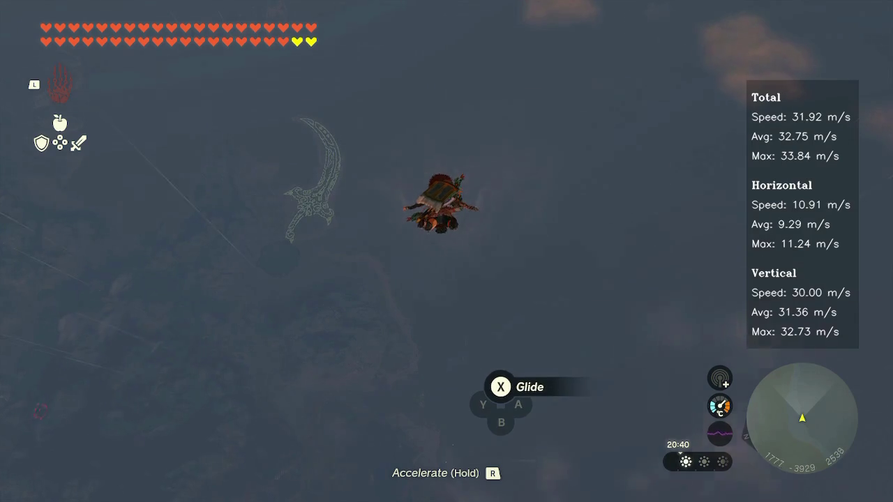

# TotK Speedometer

A speedometer for `Zelda - Tears of the Kingdom` that overlays speed information on top of a gameplay screen recording.

Provides independent stats for horizontal, vertical and total (3D) speed:
  - Current speed
    - Calculated every 10 frames for video
    - As fast as it can for real-time screen capture (about 5 FPS)
  - Average speed based on a two second moving average.
  - Maximum speed over the last two seconds.



Tested only on macOS 13.5 but should work on every platform.

## Installation

Clone or download a zip of this repository.

### Virtual Environment (optional)
```
python3 -m venv venv-totk-speedometer
source venv-totk-speedometer/bin/activate
```

### Dependencies

#### Install Tesseract
Follow the Installation instructions on the [official documentation](https://tesseract-ocr.github.io/tessdoc/Installation.html).

```
brew install tesseract
```

#### Install FFmpeg
```
brew install ffmpeg
```

Or download and install from [ffmpeg.org](https://ffmpeg.org/download.html)

#### Install python dependencies
```
pip install --upgrade pip
pip install -r requirements.txt
```

## Usage

### Add TotK speedometer overlay to video file
```
python totk-speedometer.py -f <path-to-totk-video>
```

Output files are saved to `<path-to-totk-video>/totk-speedometer-videos/`

#### Accepts multiple video files as input:
```
python totk-speedometer.py -f <path-to-totk-video-1>  <path-to-totk-video-2> ...
```

### Running from screen capture
```
python totk-speedometer.py -s
```

Select a difference monitor to capture (1, 2, 3, etc. Default is 1):
```
python totk-speedometer.py -s -m <monitor-number>
```

##### Running from screen capture is still on a initial state and may not work properly.

## Known issues:
- The map underneed the coordinates can obfuscate them and make it very hard to read. This sometimes results in wrong coordinates or not being able to read the coordinates at all.
- Running from screen capture can have a hard time detecting the map position. If it doens't work you can use the `images/detected-circles.png` and `images/detected-map-circles.png` to try to understand whats happening. Using a maximized window or a solid color background usually helps.
- Running from screen capture will be more imprecise since it uses real time to calculate speed instead of the video FPS as a time base.
- The overlay of the screen capture mode still has hardcoded size and position.

## Roadmap
- [ ] Improve the image pre-processing for better coordinate readings.
- [ ] Improve the overlay for real time speedometer display.
- [ ] Improve the map position detection for the overlay mode.

## License
Distributed under the MIT License. See `LICENSE.txt` for more information.

## Support
If you find any issues with it please report them in the issue tracker.

Keep in mind that this is a hobby project for a game, so keep a light mood and lets improve the TotK Speedometer for everyone!

## Contributing
Any contributions you make are **greatly appreciated**.

If you have a suggestion that would make this better, please fork the repo and create a pull request. You can also simply open an issue with the tag "enhancement".
Don't forget to give the project a star! Thanks again!

1. Fork the Project
2. Create your Feature Branch (`git checkout -b feature/AmazingFeature`)
3. Commit your Changes (`git commit -m 'Add some AmazingFeature'`)
4. Push to the Branch (`git push origin feature/AmazingFeature`)
5. Open a Pull Request

## Donate
If you want to buy me a coffee you can make a donation using the PayPal button bellow.

Every donation is greatly appreciated!

<div align="center">
  <a href="https://www.paypal.com/donate/?hosted_button_id=EEMCHRRXCQZCY">
    
  </a>
  <h2>Thank you for your support!</h2>
</div>
